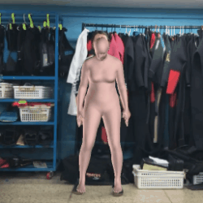
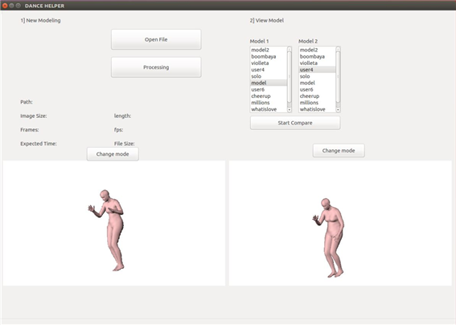

# Dance-Helper

Implement Dance Helper Program with OpenPose, SMPLify in Python

# Description

2D 영상으로부터 3D 인체 모델링을 실시하여, 안무 학습에 도움을 줄 수 있는 프로그램

원하는 프레임에서 자유롭게 시점을 변경하여 동작을 확인할 수 있다.

사용자가 원하는 동작을 입력하고, 사용자가 직접 자신의 동작을 입력하여 유사도를 분석할 수 있다.

# Requirement

Python 2.7.12, OpenCV 4.0.0, SMPL, SMPLify, OpenPose, Caffe, OpenDR 0.78

SMPL: http://smpl.is.tue.mpg.de/

SMPLify: http://smplify.is.tue.mpg.de/

OpenPose: https://github.com/CMU-Perceptual-Computing-Lab/openpose

# Paper

[향상된 3D 모델링과 유사도 측정을 이용한 동작 학습 도움.pdf (Dance Helper with Improved 3D Modeling and Similarity)](./paper.pdf)
